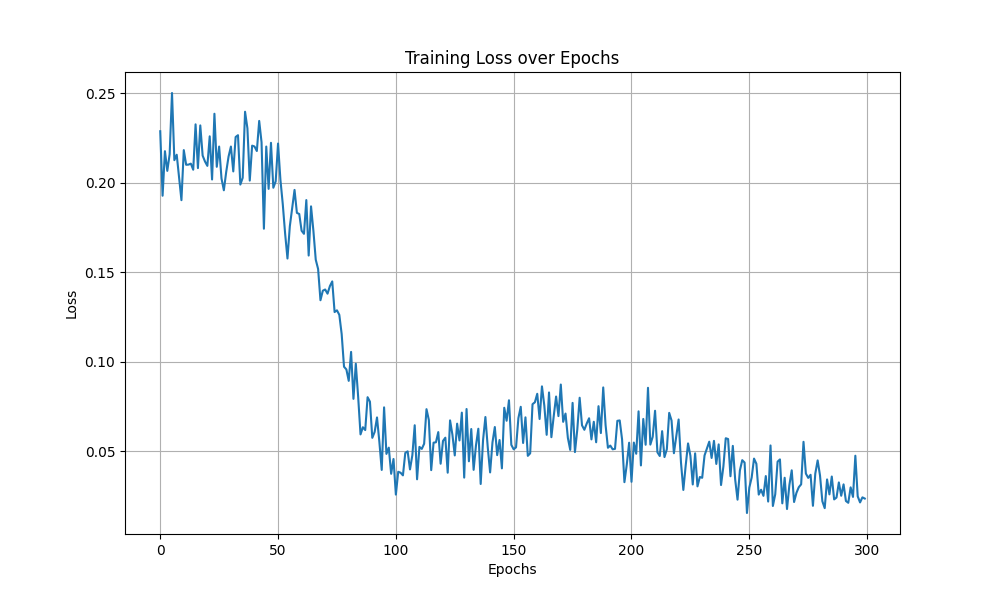
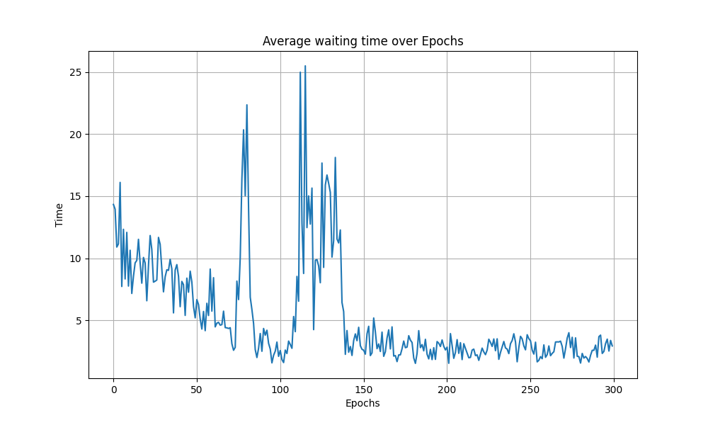

# Traffic Jam
Reinforcement learning application in traffic jam scenario.

Our main object is to reduce the total waiting time of drivers in the queue by employing a reinforcement learning model to control the traffic light.

## Main Environment
- python 3.11
- torch 2.0.1

## Installation
1. Make sure you have python 3.11 installed on your PC
2. Clone this repo to your PC
3. Install torch following the instructions [here](https://pytorch.org/get-started/locally/)
4. Install other requirements by running the following command:
    ```shell
    pip3 install -r requirements.txt
    ```

## Results
### Random Policy
- Actions: 
    ```python
    [1, 0, 0, 0, 1, 0, 1, 1, 0, 1, 1, 0, 1, 1, 1, 0, 1, 0, 1, 1, 1, 1, 1, 1, 0, 0, 1, 0, 1, 1, 0, 1, 0, 1, 1, 0, 0, 0, 1, 1, 0, 0, 1, 1, 0, 0, 0, 1, 1, 0, 0, 0, 0, 0, 0, 0, 1, 1, 1, 1, 1, 0, 1, 1, 1, 1, 1, 1, 0, 1, 0, 0, 1, 0, 0, 0, 0, 0, 0, 0, 1, 1, 1, 0, 0, 0, 0, 0, 0, 1, 0, 1, 1, 0, 0, 1, 1, 0, 1, 1]
    ```
- Average waiting time = 20.58
- Visualization:

  

### REINFORCE Agent
- Actions: 
  ```python
  [1, 0, 1, 0, 1, 0, 1, 0, 1, 0, 1, 0, 1, 0, 1, 0, 1, 0, 1, 0, 1, 0, 1, 0, 1, 0, 1, 0, 1, 0, 1, 1, 0, 1, 0, 1, 0, 1, 0, 1, 0, 0, 1, 0, 1, 0, 1, 0, 1, 0, 1, 0, 1, 0, 1, 1, 0, 1, 0, 1, 1, 0, 1, 0, 1, 0, 1, 0, 1, 0, 1, 0, 1, 0, 1, 0, 1, 0, 1, 0, 1, 0, 1, 0, 1, 0, 1, 0, 1, 0, 1, 0, 1, 0, 1, 0, 1, 0, 1, 0]
  ```
- Average waiting time = 3.67
- Visualization:

  

- Loss:

  

- Average waiting time:

  
